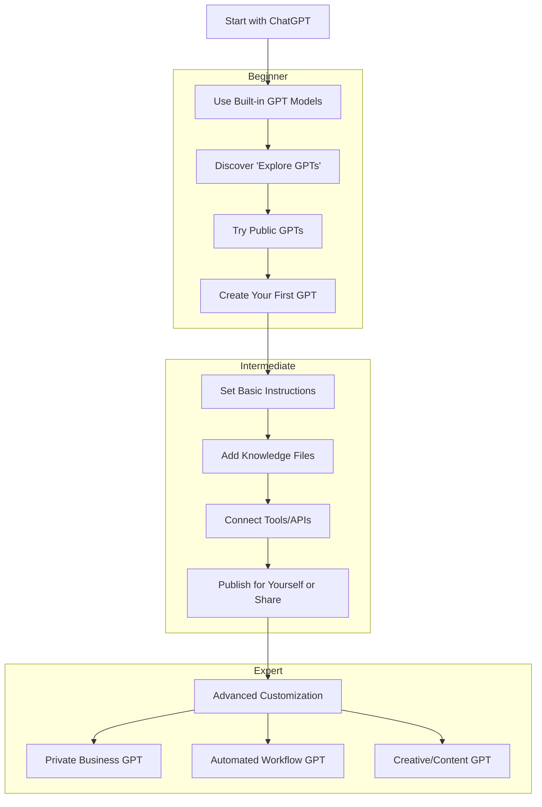

Here’s a **beginner-friendly visual chart** showing how GPTs fit into the ChatGPT ecosystem and how you move from **beginner → expert use**.

---

---

### **How to Read This**

* **Beginner**:

  * Start by using built-in ChatGPT.
  * Explore **public GPTs** in the "Explore GPTs" section to see what others made.
  * Try making a very simple one.

* **Intermediate**:

  * Write clear instructions for tone, style, and purpose.
  * Upload files (like your business catalog or study notes).
  * Link APIs or tools for extra powers (web browsing, code execution, data reading).

* **Expert**:

  * Build specialized GPTs for business automation, customer service, or creative projects.
  * Integrate into workflows—email, dashboards, CRM.
  * Keep refining your GPT over time based on feedback
